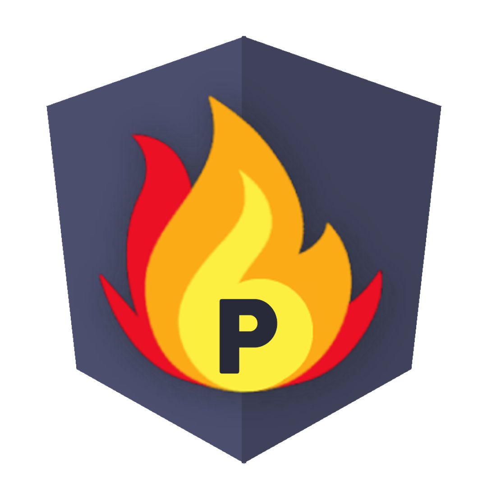

<h1 align="center">Pritudev Offcial Blog</h1>

  <em>Prit's personal website running on Gatsby, React, and Node.js.</em>

Note: The source for this site was not created to be a template or theme, but for my own use. Feel free to take whatever inspiration from it that you want, but this code was not written with the intention of being cloned and deployed. As such, I do not provide support or guidance for doing that. I recommend using the Gatsby Advanced Starter to set up a blog or an existing theme created for that purpose.

<h3 align="center">👀 Contributing</h3>

  Found any issue or wanted to add new thing in website contribute in our website prefer <a href="https://github.com/pritudev/pritudev.me/blob/master/CONTRIBUTING.md">CONTRIBUTING.md</a> 

<h3 align="center">📝 License</h3>

This project is open source and available under the MIT License.

  
  
  

_Social buttons_

